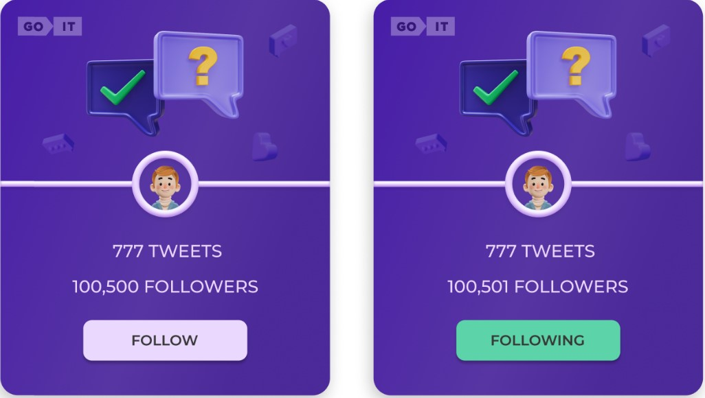

This project was bootstrapped with
[Create React App](https://github.com/facebook/create-react-app).

# Тестове завдання

_Загальний вигляд картки у двох станах - Follow та Following_

<b>Мета:</b> створити картки твітів та додати інтерактивності при клікові на
кнопку.

# Критерії виконання

<ul>
<li>Верстка фіксована в рх, семантична та валідна.</li>
<li>Немає помилок в консолі браузера.</li>
<li>Робота виконана на нативному JS з використанням зборщиків або на React.</li>
<li>Інтерактивність працює відповідно до технічного завдання.</li>
<li>Код відформатований та без коментарів.</li>
<li>В репозиторії має бути описаний README.md.</li>
</ul>

# Технічне завдання

1. Відповідно до
   [макету](https://www.figma.com/file/zun1oP6NmS2Lmgbcj6e1IG/Test?node-id=0-1&t=fKfPK1hQF3isHhAC-0)
   потрібно реалізувати картки юзера.
2. При клікові на кнопку Follow - текст змінюється на Following. Також
   змінюється колір кнопки. А до кількості фоловерів додається і ваш. Тобто,
   початкова кількість складає 100,500 фоловерів. При клікові на кнопку буде
   100,501.
3. При оновлені сторінки має фіксуватись кінцевий результат дій юзера. Тобто,
   якщо клікнути по кнопці і оновити сторінку - то кнопка все рівно залишається
   в стані Following із відповідним кольором, а кількість фоловерів НЕ
   зменшується до початкового значення.
4. При повторному клікові на кнопку її текст та колір змінюються до початкового
   стану. Також змінюється і кількість фоловерів. Вона зменшується на 1
   (100,500).
5. В коді цифра 100,500 має бути прописана одним значенням (100500). В UI -
   виведено через кому (100,500).

Створи свій персональний бекенд для розробки за допомогою UI-сервісу
[mockapi.io](https://mockapi.io/projects). Створи ресурс users з наступними
полями: _id, user, tweets, followers, avatar_.

# Додаткове завдання

Створи маршрутизацію, використовуючи React Router.

У застосунку повинні бути такі маршрути. Якщо користувач зайшов за неіснуючим
маршрутом, його необхідно перенаправляти на домашню сторінку. `'/'` – компонент
`Home`, домашня сторінка. Стилізація та оформлення на ваш розсуд `'/tweets'` -
компонент `tweets`, сторінка із відображенням твітів На сторінці `tweets` має
бути кнопка Back, яка веде на головну сторінку.

<b>_Завдання із зірочкою_</b>

Додай фільтрацію. Це має бути Dropdown із 3 опціями(оформлення на ваш розсуд):
<b>show all, follow, followings</b>. `Show all` - показати всі твіти. `Follow` -
показати твіти, у яких стан _follow_. `Followings` - показати твіти, у яких стан
_following_.
